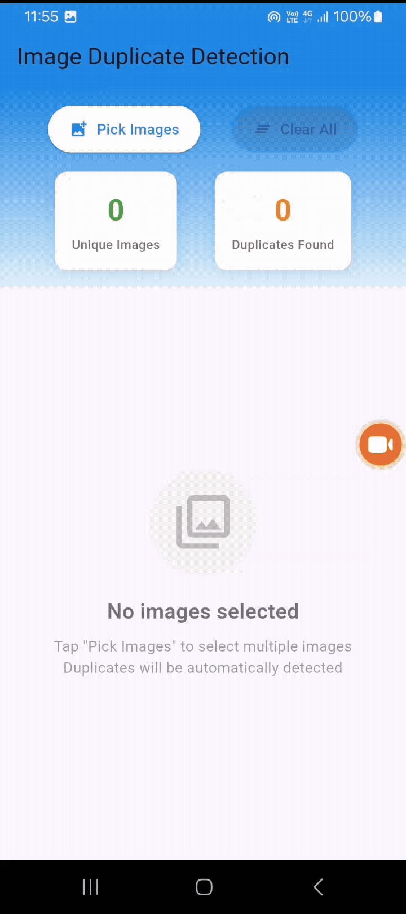

<!DOCTYPE html>
<html lang="en">
<head>
    <meta charset="UTF-8">
    <meta name="viewport" content="width=device-width, initial-scale=1.0">
    <title>Flutter Image Duplicate Detection - README</title>
</head>
<body>
    <h1>Flutter Image Duplicate Detection App</h1>
    <h2>Overview</h2>
    
A Flutter application that helps users detect and manage duplicate images. The app allows users to select multiple images and automatically identifies duplicates based on content hashing, ensuring only unique images are retained.

    <h2>Features</h2>
    <ul>
        <li><strong>Multiple Image Selection:</strong> Pick multiple images at once using the file picker</li>
        <li><strong>Duplicate Detection:</strong> Automatically detects duplicates using SHA-256 content hashing</li>
        <li><strong>Image Management:</strong> Rename, remove individual images, or clear all images</li>
        <li><strong>Statistics Display:</strong> Shows count of unique images and duplicates found</li>
        <li><strong>Visual Feedback:</strong> Clear warnings for duplicate images with detailed messages</li>
        <li><strong>Responsive Grid Layout:</strong> Clean card-based image display with thumbnails</li>
    </ul>
    <h2>App Demo</h2>
    
Below is a demonstration of the app in action:

    
    
<em>The GIF shows the complete workflow: selecting images, detecting duplicates, and managing the image collection.</em>
    
    <h2>Dependencies</h2>
    
Add these dependencies to your <code>pubspec.yaml</code> file:

    <pre>
dependencies:
  flutter:
    sdk: flutter
  file_picker: ^5.0.0
  crypto: ^3.0.0
    </pre>    
    <h2>Installation</h2>
    <ol>
        <li>Clone or download the project</li>
        <li>Run <code>flutter pub get</code> to install dependencies</li>
        <li>Run <code>flutter run</code> to start the application</li>
    </ol>    
    <h2>How It Works</h2>
    <ol>
        <li><strong>Image Selection:</strong> Tap "Pick Images" to select multiple images from your device</li>
        <li><strong>Duplicate Detection:</strong> The app generates SHA-256 hashes for each image to detect exact duplicates</li>
        <li><strong>Filtering:</strong> Duplicates are automatically filtered out and reported</li>
        <li><strong>Management:</strong> View unique images in a grid, rename them, or remove individual images</li>
    </ol>    
    <h2>Supported Image Formats</h2>
    <ul>
        <li>JPEG (.jpg, .jpeg)</li>
        <li>PNG (.png)</li>
        <li>GIF (.gif)</li>
        <li>BMP (.bmp)</li>
        <li>WebP (.webp)</li>
    </ul>    
    <h2>Architecture</h2>
    
The app follows a feature-based architecture with separate logic and UI components:

    <ul>
        <li><strong>Image Picker Feature:</strong> Handles file selection</li>
        <li><strong>Duplicate Detection Feature:</strong> Processes images and detects duplicates</li>
        <li><strong>Image Management Feature:</strong> Handles image operations (rename, remove, clear)</li>
        <li><strong>Image Display Feature:</strong> Shows images in a responsive grid</li>
        <li><strong>Statistics Feature:</strong> Displays counts and metrics</li>
    </ul>    
    <h2>Key Components</h2>
    <ul>
        <li><code>ImageData</code> - Model for storing image information</li>
        <li><code>DuplicateDetectionLogic</code> - Core logic for detecting duplicates</li>
        <li><code>ImagePickerWidget</code> - UI for image selection</li>
        <li><code>ImageGridWidget</code> - Grid display of images</li>
        <li><code>StatisticsWidget</code> - Shows app statistics</li>
    </ul>    
    <h2>Usage Tips</h2>
    <ul>
        <li>The app detects duplicates both within the selected batch and against previously loaded images</li>
        <li>Use the statistics cards to quickly see how many unique images and duplicates were found</li>
        <li>The hash preview in each image card helps identify similar content</li>
        <li>Clear all images when starting a new duplicate detection session</li>
    </ul>    
    <h2>Technical Details</h2>
    <ul>
        <li><strong>Hash Algorithm:</strong> SHA-256 for content-based duplicate detection</li>
        <li><strong>File Handling:</strong> Supports both file paths and byte arrays</li>
        <li><strong>Memory Management:</strong> Efficient handling of image data</li>
        <li><strong>Error Handling:</strong> Comprehensive error handling for file operations</li>
    </ul>    
    <h2>License</h2>
    
This project is open source and available under the MIT License.

</body>
</html>
